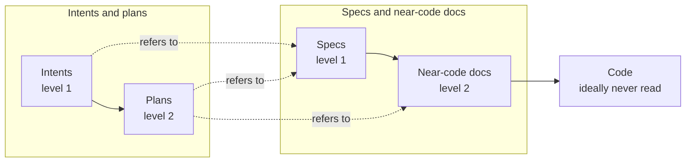

# Method

*Hypotheses H1 to H7 on the [[Inception canvas]].*

## Two planes

*A human reads documents, ideally never the code. Each level is built from the level above; plane names are working titles (Q1).*

- *Intents: ideas, proposals, roadmap, open questions, like this folder.*
- *Specs: ADRs, a [[Glossary]], pseudocode; a human reviews and partly writes them.*
- *Near-code docs: natural-language tests, dependency files,* declarations, models, etc. *See [[Review#Level 2 projections]].*

## Page formats

*Each spec is ideally a one-pager with an image, in a format from a curated list* (can be extended)*, for example arc42 canvases, C4 diagrams, ADRs or pseudocode. Pages can be split and merged.*

## Thin plans

*The user prompt plus references to the relevant specs, which must be good enough for a good implementation.*

## Do and throw

*After the first spec draft, an agent implements it to test it in reality, the spec is corrected, and only then does the user review it. The implementation is thrown away; this can repeat until a cheap model solves the task in one pass* (but we should avoid loops, so max 1 repetition).

## Workflow and tracking

*A modified spec step in a superpowers-like workflow, in any agent (Q6). Dependencies tracked later, maybe with [OpenFastTrace](https://openfasttrace.itsallcode.org/) (Q12).*
